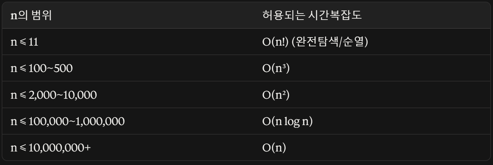

정답률 61%

- 문제 링크: https://school.programmers.co.kr/learn/courses/30/lessons/12977
- 난이도: Level 1
- 풀이: 서로 다른 3개 조합의 합이 소수인 경우의 개수 구하기

2가지 로직이 필요하다.

1. 소수를 판별하는 로직(1, 자기자신으로 나누면 됨) → nums의 원소는 1000이하의 자연수니까 for 돌려도 오버플로우는 안 남.
2. 들어온 nums.length의 C 3의 로직

2번을 생각해보자. 우선, 가장 직관적이게 for문으로 조합(nCr)을 생각해볼 수 있었다.

```java
for(int i = 0 ; i < nums.length ; i ++){
	for(int j = i + 1 ; j < nums.length ; j ++){
		for(int k = j + 1 ; k < nums.length ; k++){
			int sum = nums[i] + nums[j] + nums[k];
			//소수 판별 로직
		}
	}
}
```

오버플로우? → X

시간복잡도? → O(n^3) 시간 초과는 언제 발생할까?



100% 맞는 것은 아니지만 대략적인 지표이다. 이번 문제의 경우 n이 3~50이었으므로 시간 초과의 걱정은 없었다.

소수 판별 로직을 만들어보자.

```java
if(sum < 2) continue; //0,1 패스

boolean flag = true;
for(int m = 2 ; m * m <= sum ; m++){
	if(sum%m == 0){
		flag = false;
		break;
	}
}

if(flag == true)answer++;
```

합쳐보자.

```java
for(int i = 0 ; i < nums.length ; i ++){
	for(int j = i + 1 ; j < nums.length ; j ++){
		for(int k = j + 1 ; k < nums.length ; k++){
			int sum = nums[i] + nums[j] + nums[k];

			if(sum < 2) continue; //0,1 패스

			boolean flag = true;
			for(int m = 2 ; m * m <= sum ; m++){
				if(sum%m == 0){
					flag = false;
					break;
				}
			}

			if(flag == true)answer++;
		}
	}
}
```

isPrime 함수로 빼는 게 좋아보인다.

### 핀포인트

조합(nCr)의 코드 구현: r중 for문

만약 몇 개를 뽑을지(r)를 사용자 입력으로 받게 된다면? → 재귀 코드를 사용해야 한다. 이건 해당 문제가 나왔을 때 다시 다루어보자.
